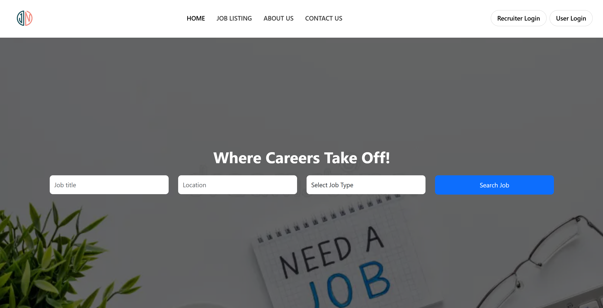
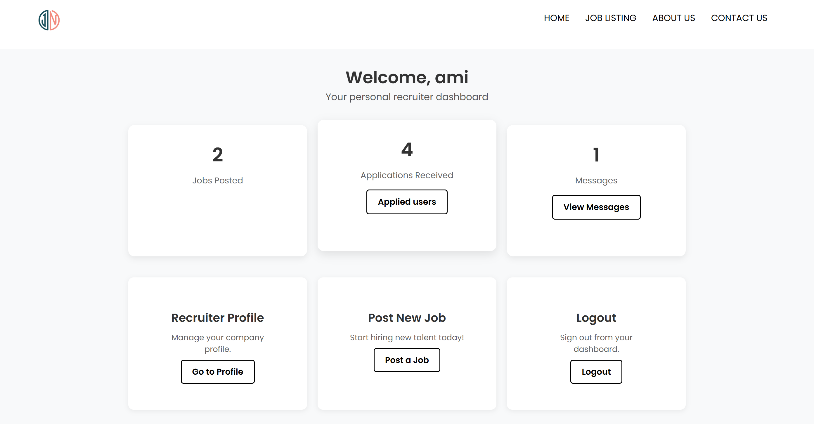
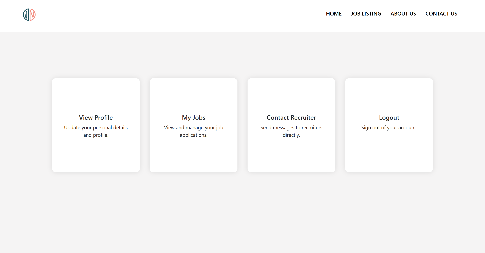

# 🌐 Online Job Portal

A modern and user-friendly job portal built using **Django**, **HTML/CSS**, and **MySQL**, designed to streamline the hiring process for companies and job seekers alike.

---

## ✨ Key Features

- 👤 **User Profiles**: Create and manage job seeker and recruiter profiles  
- 📝 **Job Posting**: Recruiters can post job vacancies with details  
- 📄 **Job Listings**: View all active job posts with filters and search  
- 👁️ **View Job Details**: Click into each job for a detailed view  
- 📤 **Apply to Jobs**: Job seekers can apply directly through the portal  
- 🧑‍💼 **Recruiter Dashboard**: Manage posted jobs and view applicants  
- 📰 **Article Management**: Sub-admins can add/edit/delete articles  
- 📬 **Contact Form**: Allows users to send messages or inquiries  
- 📂 **Categorized Listings**: Job posts and articles organized by category

---

### 🏠 Homepage

### 🧑‍💼 Recruiter Dashboard

### 👤 User Page

---

## 🔗 Live Demo

👉 [View Repository on GitHub](https://github.com/sreeja204/online-job-portal)

---

## 🛠️ Tech Stack

- **Backend**: Django, Python
- **Frontend**: HTML5, CSS3
- **Database**: MySQL
- **Version Control**: Git + GitHub

---

## 🙋‍♀️ Author

**Sreeja P.**  
📧 [sreejavenkiteshp@example.com]  
🔗 [GitHub Profile](https://github.com/sreeja204)
